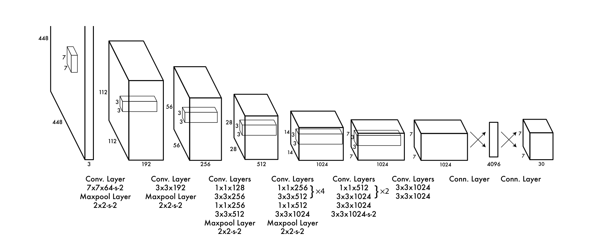
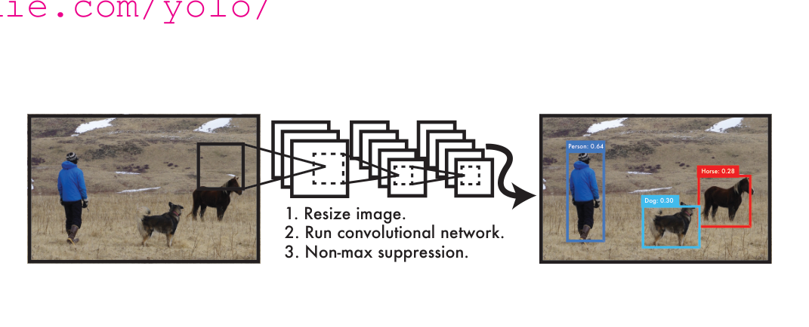
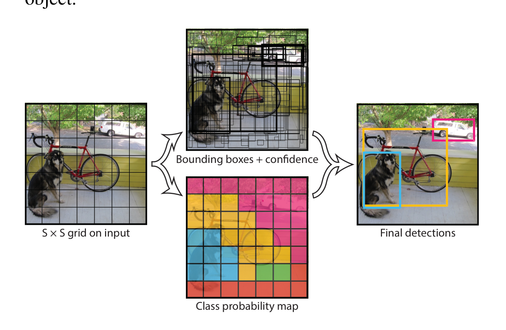
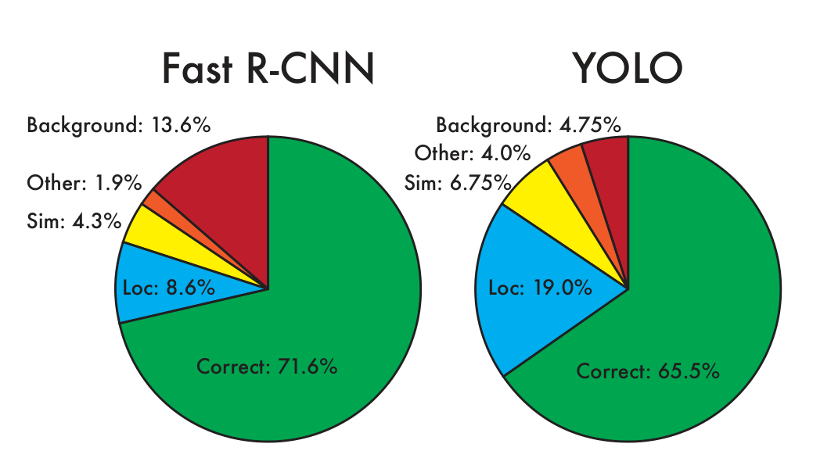
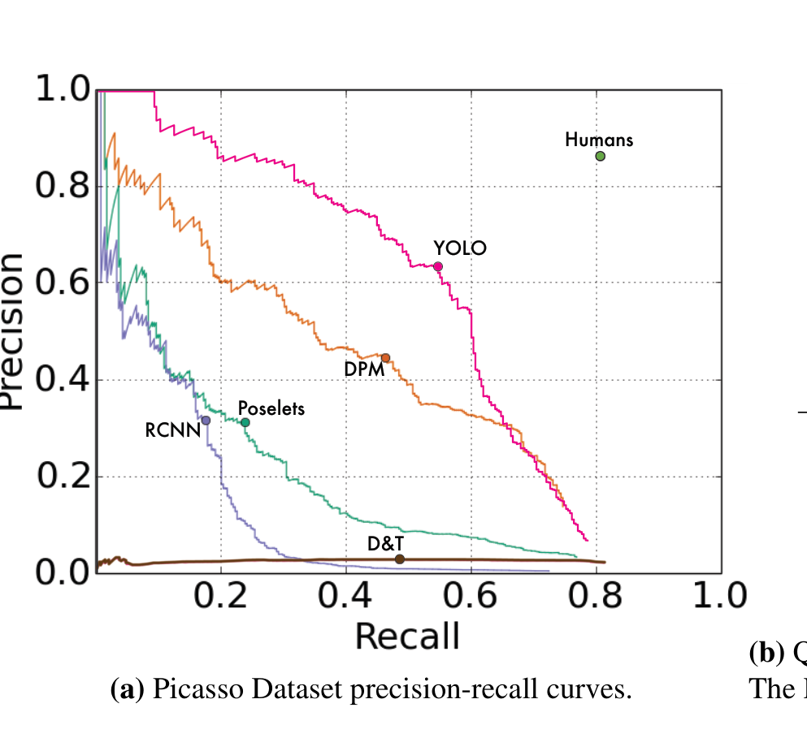
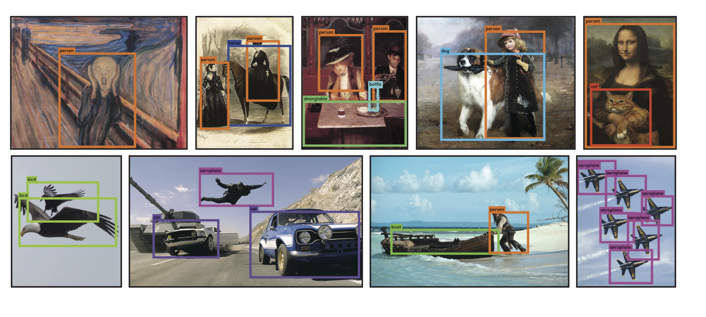

# YOLOv1 阅读笔记：You Only Look Once — 把目标检测变成一次回归

## 零、元信息

> **论文**：You Only Look Once: Unified, Real-Time Object Detection
> **作者**：Joseph Redmon、Santosh Divvala、Ross Girshick、Ali Farhadi（华盛顿大学 / Allen Institute for AI / Facebook AI Research）
> **发表**：CVPR 2016（arXiv:1506.02640v5，2016-05-09）
> **阅读时长**：约 20 分钟
> **难度**：⭐⭐⭐（需要 CNN 与目标检测基础）
> **前置知识**：卷积神经网络、IOU / mAP、PASCAL VOC、R-CNN 系列方法

## 一、TL;DR

YOLO 将目标检测重构为单一回归问题：一个 CNN 直接从整图同时预测边界框坐标与类别概率，一次前向即完成检测。核心是 S×S 网格、每格预测 B 个框的稠密设计，45 FPS 下达到 63.4% mAP。

## 二、论文概述

**问题**：滑窗（DPM）和区域建议（R-CNN）等检测方法把特征提取、候选生成、分类、框回归、后处理拆成多个独立组件，各自训练、串行推理，速度慢且无法端到端对齐检测性能。

**方案**：把检测当作回归问题，用单个卷积网络对整图一次性输出所有边界框和类别概率，训练与推理都是端到端。

**贡献**：
1. 提出统一检测网络，推理只需一次前向传播，实时运行（YOLO 45 FPS、Fast YOLO 155 FPS）
2. 全局上下文推理显著减少背景误检，背景错误不到 Fast R-CNN 的一半（4.75% vs 13.6%）
3. 学到更通用的物体表示，从自然图像迁移到艺术品时退化远小于 R-CNN / DPM

## 三、背景与动机

### 现有方法怎么做

- DPM：滑动窗口，在不同位置和尺度上运行分类器，特征、分类、回归各环节互相独立。
- R-CNN 系：先用 Selective Search 生成约 2000 个候选框，再对每个框提取卷积特征、SVM 分类、线性回归微调、NMS 去重。Fast / Faster R-CNN 只加速其中某几环。

### 存在什么问题

- R-CNN 推理一张图超过 40 秒；Fast R-CNN 只有 0.5 FPS；Faster R-CNN 最快版本也只有 7 FPS，都达不到实时（30 FPS）。
- 分类器只看到局部区域（候选框内的 patch），看不到更大上下文，容易把背景当物体。Fast R-CNN 的 top 检测里 13.6% 是背景误检。
- 流水线各组件必须分别调优，损失与最终检测指标（mAP）不对齐。

### 根本原因

检测被分解成“候选生成 + 分类”两阶段，优化目标被割裂；局部视图丢失全局上下文；重复计算导致实时性差。YOLO 的选择是抛弃流水线，让网络自己完成全部推理。

## 四、核心方法

### 整体架构



**图示内容**：YOLO 网络结构，24 层卷积 + 2 层全连接，交替使用 1×1 降维层与 3×3 卷积层（借鉴 GoogLeNet 但不用 Inception），最终输出 7×7×30 张量。

**关键信息**：
- 输入 448×448×3，先经 24 层卷积提取特征
- 两个全连接层（4096 → 7×7×30）把特征映射为预测张量
- 输出张量按 S×S 网格排布，每个格子携带 B×5+C 个值

**与正文对应**：第 2.1 节 Network Design、Figure 3。

数据流：输入图像 → 缩放为 448×448 → 24 层卷积 + 2 层全连接 → 7×7×30 预测张量 → 按置信度阈值过滤 → NMS → 最终检测框。



**图示内容**：YOLO 检测系统三步流程：resize → 单次卷积网络推理 → 非极大值抑制，图上展示了 dog / person / horse 的检测结果与置信度。

**关键信息**：
- 整个检测只需一次网络评估，没有候选框生成阶段
- 置信度同时编码“有无物体”和“框有多准”

**与正文对应**：第 1 节 Introduction、Figure 1。

### 网格预测模型



**图示内容**：输入被划分为 S×S 网格；每个格子预测 B 个边界框及置信度，并输出 C 个条件类别概率，最终形成 S×S×(B×5+C) 张量。

**关键信息**：
- 物体中心落在哪个格子，就由哪个格子负责检测
- 每格只预测一组类别概率（与 B 无关）
- VOC 上 S=7、B=2、C=20，输出 7×7×30

**与正文对应**：第 2 节 Unified Detection、Figure 2。

#### 输出编码

每个边界框由 5 个值组成：x、y、w、h、confidence。

- (x, y)：框中心相对所在格子的偏移，归一化到 [0,1]
- (w, h)：框宽高相对整幅图像，归一化到 [0,1]
- confidence：$Conf = \Pr(\text{Object}) \times \text{IOU}_{\text{pred}}^{\text{truth}}$，同时表达“格子里有没有物体”和“预测框与真值的重合度”

每个格子还预测 C 个条件类别概率 $\Pr(\text{Class}_i | \text{Object})$。测试时两者相乘得到类别置信度：

$$\Pr(\text{Class}_i | \text{Object}) \times \Pr(\text{Object}) \times \text{IOU}_{\text{pred}}^{\text{truth}} = \Pr(\text{Class}_i) \times \text{IOU}_{\text{pred}}^{\text{truth}}$$

这个分数同时反映“框内是该类物体的概率”和“框定位的好坏”。

#### 伪代码

```python
def detect(image, net):
    img = resize(image, (448, 448))          # 1. 统一尺寸
    tensor = net.forward(img)                # 2. 一次前向，输出 7×7×30
    boxes = decode_boxes(tensor)             # 98 个候选 (x, y, w, h, conf)
    scores = conf * class_prob               # 类别置信度
    keep = scores.max(axis=-1) > 0.2         # 3a. 置信度阈值
    return non_max_suppression(boxes[keep])  # 3b. NMS 去重
```

### 损失函数

训练采用多部分 sum-squared error（论文公式 3）：

$$\mathcal{L} = \lambda_{coord} \sum_{i=0}^{S^2}\sum_{j=0}^{B} \mathbb{1}_{ij}^{obj}\left[(x_i-\hat{x}_i)^2 + (y_i-\hat{y}_i)^2\right]$$

$$+ \lambda_{coord} \sum_{i=0}^{S^2}\sum_{j=0}^{B} \mathbb{1}_{ij}^{obj}\left[(\sqrt{w_i}-\sqrt{\hat{w}_i})^2 + (\sqrt{h_i}-\sqrt{\hat{h}_i})^2\right]$$

$$+ \sum_{i=0}^{S^2}\sum_{j=0}^{B} \mathbb{1}_{ij}^{obj}(C_i-\hat{C}_i)^2 + \lambda_{noobj} \sum_{i=0}^{S^2}\sum_{j=0}^{B} \mathbb{1}_{ij}^{noobj}(C_i-\hat{C}_i)^2$$

$$+ \sum_{i=0}^{S^2} \mathbb{1}_{i}^{obj} \sum_{c \in classes} (p_i(c)-\hat{p}_i(c))^2$$

逐项解释：
- $\mathbb{1}_{ij}^{obj}$：格子 i 的第 j 个预测器负责某个真实物体（它与真值的 IOU 在该格所有预测器中最高）
- $\mathbb{1}_{i}^{obj}$：格子 i 中存在物体；类别误差只在有物体的格子上计算
- $\lambda_{coord}=5$：放大坐标误差权重，因为大部分格子没有物体，坐标项天然稀少
- $\lambda_{noobj}=0.5$：压低无物体格子的置信度误差，避免背景格子的“置信度压到 0”的梯度淹没前景梯度
- $\sqrt{w}, \sqrt{h}$：大框的小偏差对 IOU 影响小，小框影响大；对宽高开方相当于按相对尺度放大对小框的惩罚，使损失更接近 IOU 语义
- 同一格子的 B 个框共享类别概率，互不竞争类别

### 训练策略

1. 预训练：取前 20 层卷积 + 平均池化 + 全连接，在 ImageNet 1000 类上以 224×224 训练约一周，top-5 准确率 88%
2. 迁移检测：追加 4 层卷积 + 2 层全连接（随机初始化），输入分辨率从 224×224 翻倍到 448×448，保留细粒度视觉信息
3. 激活函数：除最后一层用线性激活外，其余层用 leaky ReLU：$\phi(x) = x\ (x>0),\ 0.1x\ (\text{otherwise})$（论文公式 2）
4. 超参数：135 epochs、batch size 64、momentum 0.9、weight decay 5×10⁻⁴
5. 学习率：前若干轮从 10⁻³ 线性升到 10⁻²（预热防止早期发散），之后 10⁻²×75 epochs、10⁻³×30 epochs、10⁻⁴×30 epochs
6. 正则与增强：第一个全连接层后 dropout 0.5；随机缩放和平移最多 20%；HSV 空间随机调整曝光与饱和度最多 1.5 倍

### 推理细节

- VOC 上一张图只产生 98 个边界框，远少于 Selective Search 的约 2000 个
- NMS 对 YOLO 不像 R-CNN / DPM 那样关键，但能带来 2-3% mAP 提升

### 设计分析

**为什么用回归而不是分类器扫描？** 分类器检测必须枚举位置与尺度，重复计算且看不到全局；回归让网络一次性看到整图，把“哪里有什么”变成一步预测，训练目标直接对应检测质量。

**为什么每格 2 个框、1 组类别？** 每格多个框是为了覆盖不同尺寸与宽高比；责任分配机制让不同预测器自发特化。类别概率只预测一组，是因为同格两个框大概率属于同一类，也显著缩小输出张量。

**为什么对宽高开方？** 直接对 w/h 用平方误差会平等惩罚大小框的绝对偏差，但同等绝对偏差对小框的 IOU 伤害远大于大框；开方近似把误差按相对尺度加权。

**为什么 λ_coord 大、λ_noobj 小？** 图像里大部分格子没有物体，若不调整，无物体格子的置信度梯度会淹没少数有物体格子的梯度，训练早期易发散。

## 五、实验分析

### 实时检测对比（VOC 2007，表 1）

| 方法 | 训练数据 | mAP | FPS |
|---|---|---|---|
| 100Hz DPM | 2007 | 16.0 | 100 |
| 30Hz DPM | 2007 | 26.1 | 30 |
| Fast YOLO | 2007+2012 | 52.7 | 155 |
| YOLO | 2007+2012 | 63.4 | 45 |
| Fastest DPM | 2007 | 30.4 | 15 |
| R-CNN Minus R | 2007 | 53.5 | 6 |
| Fast R-CNN | 2007+2012 | 70.0 | 0.5 |
| Faster R-CNN VGG-16 | 2007+2012 | 73.2 | 7 |
| Faster R-CNN ZF | 2007+2012 | 62.1 | 18 |
| YOLO VGG-16 | 2007+2012 | 66.4 | 21 |

关键结论：Fast YOLO 是当时已知最快的检测器，mAP 是其他实时检测器的两倍以上；YOLO 比 Fast YOLO 高约 10 mAP 仍保持实时。精度最高的 Faster R-CNN 比 YOLO 慢约 6 倍。

### 误差分析（VOC 2007，图 4）



**图示内容**：YOLO 与 Fast R-CNN 在 top N 检测上的错误构成（Correct / Localization / Similar / Other / Background 五类占比）。

**关键信息**：
- YOLO：Correct 65.5%，Localization 19.0%，Background 4.75%
- Fast R-CNN：Correct 71.6%，Localization 8.6%，Background 13.6%
- Fast R-CNN 的背景误检约为 YOLO 的 3 倍

**与正文对应**：第 4.2 节、Figure 4。

结论：YOLO 的主要错误来源是定位（超过其他所有错误之和）；Fast R-CNN 主要输在把背景当成物体。两类错误互补，为后面的模型组合提供了动机。

### 模型组合（表 2）

| 模型 | mAP | Combined | Gain |
|---|---|---|---|
| Fast R-CNN | 71.8 | — | — |
| Fast R-CNN (2007 data) | 66.9 | 72.4 | +0.6 |
| Fast R-CNN (VGG-M) | 59.2 | 72.4 | +0.6 |
| Fast R-CNN (CaffeNet) | 57.1 | 72.1 | +0.3 |
| YOLO | 63.4 | 75.0 | +3.2 |

结论：用 YOLO 给 Fast R-CNN 的检测重新打分（rescore），消除背景误检，mAP 从 71.8 涨到 75.0（+3.2%）；而不同版本 Fast R-CNN 互相组合只有 +0.3~0.6。这说明增益来自错误模式的互补，而不是简单的模型集成。Fast R-CNN + YOLO 在 VOC 2012 上以 70.7 mAP 排到公开榜第四（+2.3%）。

### VOC 2012（表 3）

YOLO 在 VOC 2012 test 上 57.9 mAP，是榜单上唯一的实时检测器。它的小物体类表现弱（bottle、sheep、tv/monitor 比 R-CNN 低 8-10%），但在 cat、train 等类别上超过多数方法。

### 跨域泛化（图 5）



**图示内容**：Picasso 数据集上的 precision-recall 曲线（YOLO、DPM、R-CNN、Poselets、D&T）。

**关键信息**（VOC 2007 → Picasso / People-Art）：

| 方法 | VOC 2007 AP | Picasso AP | People-Art AP |
|---|---|---|---|
| YOLO | 59.2 | 53.3 | 45 |
| R-CNN | 54.2 | 10.4 | 26 |
| DPM | 43.2 | 37.8 | 32 |

**与正文对应**：第 4.5 节、Figure 5。

结论：R-CNN 依赖为自然图像调优的 Selective Search 和局部 patch 分类，换到绘画风格后 AP 从 54.2 暴跌到 10.4；YOLO 对物体的尺寸、形状和共现关系建模，跨域只下降约 6 个点。像素层面艺术与照片差异巨大，但物体的尺度与形状分布相似，YOLO 因此仍能定位。

### 定性结果



**图示内容**：YOLO 在艺术品和互联网自然图像上的检测结果，多数检测正确，个别错误（把一个人识别成飞机）。

**与正文对应**：第 5 节、Figure 6。

### 局限性（论文自述）

- 空间约束：每格最多 2 个框、只能有一个类别，成群的小物体（如鸟群）很难召回
- 定位误差是主要错误来源；多轮下采样导致特征粗糙，小物体更弱
- 对没见过的新宽高比或物体构型泛化差
- 损失把大框与小框的误差同等对待，与 IOU 语义不完全一致

## 六、深度理解问答

### Q1：为什么 YOLO 不用候选框，却能做到不错的速度精度平衡？

两阶段方法把“找可能的位置”和“判断是什么”分开：候选生成器产生约 2000 个框，分类器逐框处理，重复计算多、环节耦合难调。YOLO 用 S×S 网格把“位置”离散化，让网络用全局特征一次性决定每个格子是否包含物体、框在哪里、属于什么类。代价是候选质量完全依赖网格分辨率，密集小物体场景吃亏，但换来了一次前向的推理和端到端训练。

### Q2：confidence 同时表示“有没有物体”和“框准不准”，这两件事怎么合在一个数里？

训练时格子有物体时，置信度回归目标就是该预测框与真值的 IOU（接近 1 表示又准又有）；没有物体时目标为 0。所以置信度不是概率，而是“有物体且框得准”的复合分数。测试时再乘上条件类别概率，就得到类别置信度 $\Pr(\text{Class}_i) \times \text{IOU}$，同时参与类别判断和 NMS 排序。

### Q3：为什么每个格子预测 2 个框，但只有 1 组类别概率？

类别概率按格子预测，因为同一格子内的两个框通常属于同一个物体（S=7 时每格约占图像 1/49）。B>1 的价值在于覆盖同一位置附近不同尺寸与宽高比的框，比如一个又高又瘦的人和一只趴着的狗。如果每个框都带一组 20 维类别概率，输出张量会从 30 维膨胀到 50 维，训练难度和过拟合风险都会上升。

### Q4：训练时“IOU 最高的预测器负责”，这个机制为什么重要？

如果没有责任分配，两个预测器会同时向同一个真值回归，梯度互相拉扯，谁也学不精准。按当前 IOU 最高者负责，每个预测器只对“自己最擅长的那类形状”负责，逐渐特化：一个偏瘦长框，一个偏方形框，整体召回和定位都更好。这也让 B=2 的容量被有效利用。

### Q5：为什么 YOLO 在艺术品上表现比 R-CNN 好这么多？

R-CNN 的候选框来自为自然图像调优的 Selective Search，绘画里没有清晰的边缘和纹理，候选质量崩塌；分类器只看局部 patch，对风格变化敏感。YOLO 不需要外部候选，它直接回归物体位置，学到的是“物体的尺寸、宽高比、物体间的相对位置关系”，这些在艺术与照片之间是相似的，因此跨域退化小。这也说明端到端学习到的表示比手工流水线更鲁棒。

### Q6：YOLO 的主要短板是什么，后来的工作从哪些方向修它？

论文自述短板集中在三处：定位误差大、小物体弱、密集物体漏检。后续 YOLOv2 引入 anchor、更高分辨率与多尺度训练改善召回和定位；YOLOv3 用多尺度特征图（FPN 思路）检测不同大小物体。这些改进都能追溯到 YOLOv1 指出的具体失效点。

## 七、总结与思考

### 核心贡献

- 把检测从“候选生成 + 分类”重构为单网络回归，端到端训练、一次前向推理
- 实时性代际提升：Fast YOLO 155 FPS、YOLO 45 FPS，mAP 翻倍于同期实时检测器
- 全局推理显著压低背景误检，并让模型学到可跨域迁移的物体表示
- 展示了“错误互补”的模型组合价值：YOLO 给 Fast R-CNN rescore 提升 3.2 mAP

### 局限性

- 网格化的强空间约束限制密集与小物体检测
- 定位误差为主要错误来源，特征经过多次下采样而粗糙
- 损失函数与 IOU 语义不完全对齐，大小框误差权重失衡
- 对不常见宽高比和构型的泛化有限

### 适用场景

- 实时视频流、嵌入式与低延迟场景（45-155 FPS）
- 需要端到端联合训练、推理链路简单的系统
- 与高精度两阶段模型组合，利用错误互补提升整体 mAP
- 跨域快速部署（艺术、手绘、游戏画面等非自然图像）

---

*笔记基于 arXiv:1506.02640v5（2016-05-09）全文整理，数据与公式均对照原文。*
